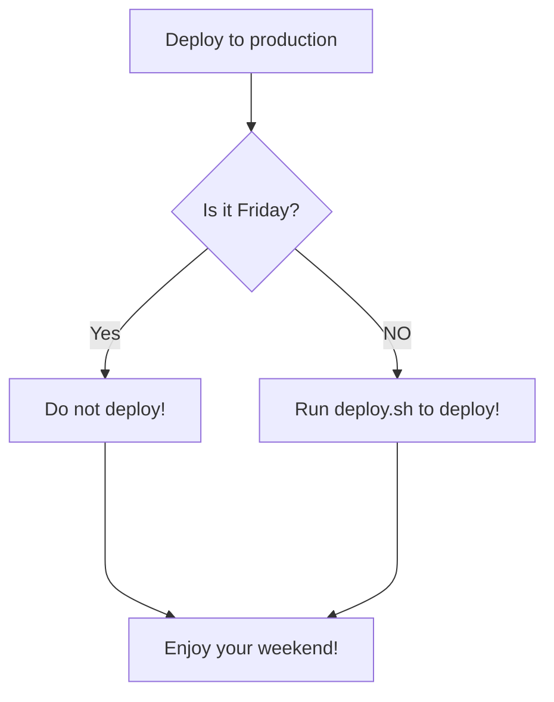

```mermaid
  graph TD;
      A-->B;
      A-->C;
      B-->D;
      C-->D;
```

```mermaid
  flowchart TD;
      A[Deploy to production]-->B{Is it Friday?};
      B-- Yes -->C[Do not deploy!];
      B-- NO -->D[Run deploy.sh to deploy!];
      C ----> E[Enjoy your weekend!];
      D ----> E[Enjoy your weekend!];
```
